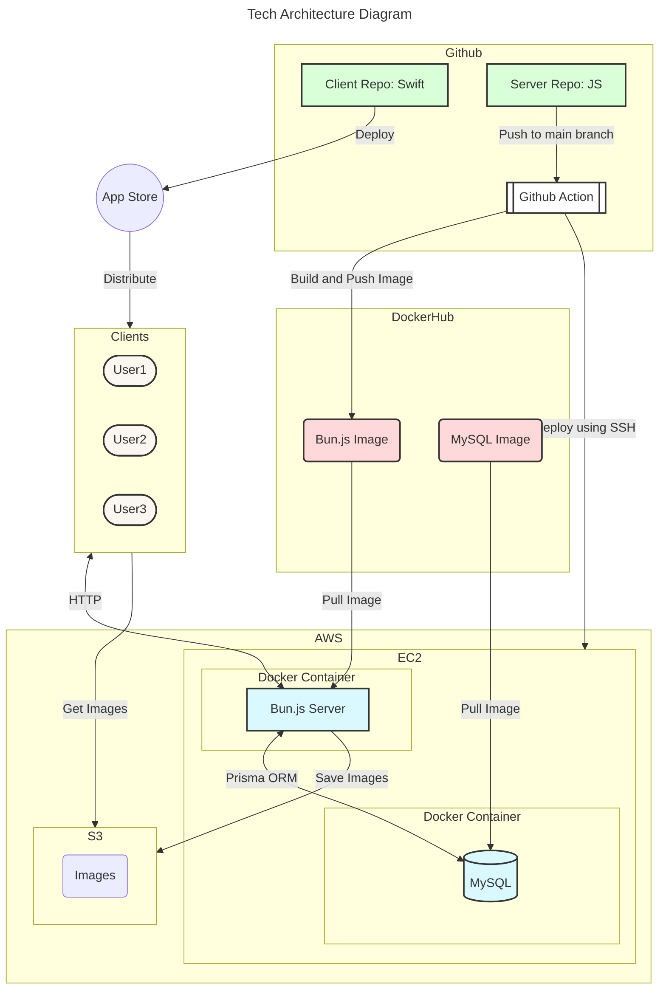
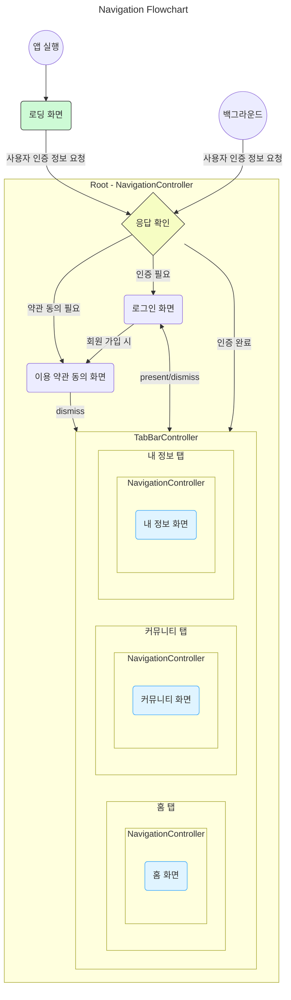

# 티로그 <!-- omit in toc -->

>**오늘을 기록하는 습관, 티로그와 함께 티로깅 여정을 시작해봐요!**


## 다운로드

<a href="https://apps.apple.com/kr/app/%ED%8B%B0%EB%A1%9C%EA%B7%B8/id6471487394">
  
</a>


## 개발 참여

먼저, [프로젝트 관리](#프로젝트-관리)를 읽어보세요.

### 준비물

- Xcode 15.0 이상
- [brew](https://brew.sh) (아래 패키지를 설치합니다.)
- [SwiftLint](https://github.com/realm/swiftlint)
- swiftformat-for-xcode

### 시작하기

1. 저장소를 클론합니다.

   ```bash
   $ git clone https://github.com/nbcamp/tlog-ios.git
   ```

2. `develop` 브랜치로 이동합니다.

   ```bash
    $ git checkout develop
    ```

3. `develop` 브랜치로부터 새로운 브랜치를 생성합니다.

    ```bash
    $ git checkout -b feature/[이슈번호]
    ```

4. `TLog.xcodeproj` 파일을 Xcode로 실행합니다.

5. 작업 완료 후, `develop` 브랜치로 Pull Request를 생성합니다.

   ```bash
   $ git push origin feature/[이슈번호]
   ```

6. Pull Request를 생성합니다.

---

## 프로젝트 소개


티로그는 작성한 TIL을 관리하고 커뮤니티를 통해 타인과 공유할 수 있는 서비스입니다.  \
꾸준히 작성하기 어려운 TIL 작성. 티로그와 함께하며 오늘 배운 내용을 기록하는 습관을 만들어보세요.

> TIL이란, Today I Learned의 약자로 "오늘 내가 배운 내용"을 그 날 배운 새롭거나 흥미로운 내용을 간단하게 정리하여 기록하는 것을 말합니다.

## 프로젝트 시연

[](https://youtu.be/xOVvYo66PoI)

### 제공하는 기능

- OAuth 기반의 사용자 인증 기능을 제공하여 손쉽게 로그인할 수 있습니다. (Apple)
- 블로그의 RSS 주소를 통해 새롭게 작성한 게시글을 자동으로 앱에 등록할 수 있습니다.
- 작성한 글을 달력을 통해 일/월별 단위로 조회할 수 있습니다.
- 오늘을 포함한 TIL 연속 작성일을 계산하여 달력에 시각적으로 표시합니다.
- 앱에 등록한 게시글을 커뮤니티에 공유하여 타인과 소통할 수 있습니다.
- WebView를 제공하여 앱 내에서 게시글을 확인할 수 있습니다.
- 게시글의 제목, 내용, 태그 기반으로 검색할 수 있습니다.
- 게시글에 좋아요를 눌러 따로 저장할 수 있고, 다른 사용자를 팔로우할 수 있습니다.
- 다른 사용자가 좋아요한 게시물을 확인할 수 있습니다.
- 차단/신고 기능을 제공합니다. 차단할 경우, 해제하지 않는 한 해당 사용자를 찾을 수 없습니다.

## 프로젝트 관리

### Git 관련

<details>
  <summary>Git Workflow</summary>

  <ol>
    <li><code>git clone [저장소 이름]</code></li>
    <li><code>cd [저장소 이름]</code></li>
    <li><code>git checkout develop</code></li>
    <li><code>git checkout -b feature/[이슈번호]</code></li>
    <li><code>git status</code></li>
    <li><code>git add [작업한 파일]</code></li>
    <li><code>git commit</code> (Commit Convention 항목 참고)</li>
    <li><code>git push origin feature/[이슈번호]</code></li>
    <li>Pull Request 생성 (<a target="_blank" href="https://github.com/cli/cli">gh</a>도 사용해보세요!)</li>
    <li>Code Review</li>
    <li>Merge (Conflict 발생 시 대응 전략 항목 참고)</li>
    <li><code>git checkout develop</code></li>
    <li><code>git pull origin develop</code> <b>→ 주의!! 새로운 브랜치 생성 시 반드시 진행할 것</b></li>
    <li>3번 항목부터 반복</li>
  </ol>
</details>

<details>
  <summary>Commit Convention</summary>
  <ul>
    <li> 첫 줄에 <b>유형</b>과 <b>작업한 내용 설명</b>을 반드시 작성합니다.
    <li> <b>작업한 내용 설명</b>은 한글로 작성하셔도 됩니다. (e.g. <code>feat: 로그인 페이지 추가</code>)
    <li> 작업한 내용에 대해 부가 설명이 필요하다면 <code>body</code>에 작성합니다.
    <li> 각 문단은 반드시 한 칸 띄워져 있어야 합니다.
  </ul>

  ```
  유형: 작업한 내용 설명

  optional body

  optional footer

  # 유형: description
  # ------------------------------------------------
  # feat: 새로운 기능 추가
  # fix: 버그 수정
  # docs: 문서 수정
  # style: 코드 포맷팅, 세미콜론 누락, 코드 변경이 없는 경우
  # refactor: 코드 리펙토링
  # test: 테스트 코드, 리펙토링 테스트 코드 추가
  # chore: 빌드 업무 수정, 패키지 매니저 수정
  ```
</details>

<details>
  <summary>Branching 전략</summary>
  <ul>
    <li><code>main</code>, <code>develop</code>, <code>feature</code>, <code>hotfix</code> 브랜치를 활용합니다.</li>
    <ul>
      <li><code>main</code>: 현재 배포할 브랜치입니다.</li>
      <li><code>develop</code>: 개발 진행 중인 브랜치입니다.</li>
      <li><code>feature</code>: 기능 단위의 브랜치입니다.</li>
      <li><code>hotfix</code>: <code>main</code> 브랜치에서 발생한 치명적인 문제를 수정하기 위한 브랜치입니다.</li>
    </ul>
    <li><code>feature</code> 브랜치는 반드시 <code>develop</code> 브랜치로부터 분기해야 합니다.</li>
    <li><code>feature</code> 브랜치 이름 규칙: <code>feature</code>이슈번호` (e.g. `feature/15`)</li>
  </ul>
</details>

<details>
  <summary>Merge 전략</summary>
  <ul>
    <li><s>Merge Commit</s></li>
    <ul>
      <li>병합하려는 커밋 목록과 함께 새로운 병합 커밋을 생성하여 목적 브랜치에 병합합니다.</li>
      <li>사용하지 않습니다.</li>
    </ul>
    <li>Squash Merge</li>
    <ul>
      <li>Pull Request에서 발생한 커밋 목록을 하나로 묶어 생성한 하나의 커밋을 목적 브랜치에 병합합니다.</li>
      <li>생성한 Pull Request를 develop 브랜치에 병합할 때 사용합니다.</li>
    </ul>
    <li>Rebase Merge</li>
    <ul>
      <li>로컬 브랜치를 최신화할 때 사용합니다.(develop → 현재 작업 중인 브랜치로 병합할 때)</li>
      <li>develop -> main 병합할 때 사용합니다.</li>
      <li> main 혹은 develop 브랜치의 히스토리를 깔끔하게 유지할 수 있습니다.</li>
      <li>해당 이슈에 치명적인 문제가 있을 때 해당 작업만 Drop하기 쉽습니다.</li>
      <li>새로운 커밋 생성 없이, 기존 커밋에 곧바로 병합합니다.</li>
      <li>기존의 커밋 히스토리를 그대로 유지한 채로 최신화할 수 있습니다.</li>
      <li>새로운 병합 커밋을 생성하지 않으므로 <a href="https://www.dmitriydubson.com/post/trunk-dev-wip-commits/">WIP Commit</a>과 함께 사용하기 용이합니다.</li>
    </ul>
  </ul>
</details>

<details>
  <summary>Resolve Conflict 전략</summary>
  <ul>
    <li>Pull Request 병합 과정에서 충돌이 발생했을 때 진행합니다.</li>
    <li>충돌 해결은 반드시 로컬에서 진행합니다. 임의로 Github 사이트 내에서 진행하지 않습니다.</li>
    <li>충돌 해결 후 프로젝트가 제대로 실행되는지 반드시 확인합니다.</li>
    <li>충돌 해결을 위해 <a blank="_target" href="https://code.visualstudio.com/docs/sourcecontrol/overview#_3way-merge-editor">VSCode 3-way Merge Editor</a>를 활용해보세요.</li>
  </ul>

  ```bash
  # 1. 현재 작업 브랜치에 위치해있습니다.
  $ git branch
  main
  develop
  * feature/10 

  # 2. 현재 작업 중인 변경내역이 있다면 진행해주세요. (브랜치 변경 안될 때)
  # 임시로 모든 변경 사항을 wip 커밋으로 만들어둡니다.
  $ git add .
  $ git commit -m "wip" # work in progress란 의미

  # 3. 반드시 develop 브랜치로 이동 후 pull을 해주세요.
  $ git checkout develop 
  $ git pull origin develop

  # 4. 다시 작업 브랜치로 이동 후 rebase를 진행합니다.
  $ git checkout feature/10
  $ git rebase develop # 충돌 발생!

  # 5. 충돌을 해결합니다.
  # 5-1. 충돌을 해결하고 continue로 rebase를 계속 진행합니다.
  $ git rebase --continue
  # 5-2. 충돌 해결 도중 취소하고 싶다면 abort로 되돌립니다.
  $ git rebase --abort

  # 6. 2번 작업을 진행해서 wip 커밋이 있다면, 반드시 reset해주세요.
  # wip 커밋이 원격 저장소로 올라가지 않도록 주의해주세요.
  $ git reset HEAD^

  # 5. 작업 브랜치를 강제로 push합니다.
  # ref: https://stackoverflow.com/q/52823692
  $ git push --force-with-lease origin feature/10
  ```
</details>

<details>
  <summary>Github Project</summary>
  <ul>
    <li><a blank="_target" href="https://github.com/orgs/nbcamp/projects/1/views/1">Github Project</a>를 활용하여 프로젝트를 관리합니다.</li>
    <li>작업(Task) 진행 관리</li>
    <ul>
      <li><code>할 일</code>대기 중인 작업 목록입니다.</li>
      <li><code>진행 중</code>현재 진행 중인 작업 목록입니다.</li>
      <li><code>코드 리뷰</code>코드 리뷰가 필요하거나 진행 중인 작업 목록입니다.</li>
      <li><code>변경 필요</code>코드 리뷰를 마치고 변경이 필요한 작업 목록입니다.</li>
      <li><code>병합 대기 중</code>코드 리뷰 완료 후 병합 대기 중인 작업 목록입니다.</li>
      <li><code>완료</code>완료되어 병합된 작업 목록입니다.</li>
    </ul>
    <li>작업 순서</li>
    <ol>
      <li><code>할 일</code>목록에서 작업할 티켓을 골라 본인을 할당합니다.</li>
      <li><code>할 일</code>목록에서 진행할 작업 티켓을 <code>진행 중</code>목록으로 옮깁니다.</li>
      <li>작업이 완료되면 Pull Request를 생성하고 코드 리뷰를 받습니다.</li>
      <li>본인의 티켓이 <code>변경 필요</code>목록에 위치한다면 이를 우선적으로 <code>진행 중</code>목록으로 옮긴 뒤 작업합니다.</li>
      <li>이하 작업은 자동으로 이뤄집니다.</li>
      <ol>
        <li>Pull Request 생성 시 <code>코드 리뷰</code>로 이동합니다.</li>
        <li>다른 사람들은 올라온 Pull Request에 대해 코드 리뷰를 진행해주셔야 합니다. 코드 리뷰 승인 시 <code>병합 대기 중</code>목록으로 이동합니다.</li>
        <li>Pull Request가 Changes Request 상태로 변경되면 <code>변경 필요</code>목록으로 이동합니다.</li>
        <li>Pull Request가 병합되면 <code>완료</code>목록으로 이동합니다.</li>
      </ol>
    </ol>
  </ul>
</details>

### 코드 관련

<details>
  <summary>코드 컨벤션</summary>
  <ul>
    <li>프로젝트의 안정성 및 코드 품질을 유지하기 위해 SwiftFormat과 SwiftLint를 적용합니다.</li>
    <ul>
      <li>SwiftFormat: 설정한 규칙에 맞춰 코드를 포맷팅해줍니다.</li>
      <li>SwiftLint: 작성한 Swift 코드에서 발생할 수 있는 잠재적인 문제와 컨벤션 오류를 감지합니다.</li>
    </ul>
    <li>좀더 Swift스러운 코드를 작성하기 위해 <a href="https://www.swift.org/documentation/api-design-guidelines">API Design Guideline</a>을 기반으로 코드를 작성합니다. 이에 관해 코드 리뷰에서 의논해봅시다.</li>
    <li>높은 품질을 가진 코드는 잠재적인 버그를 최소화하고 읽기 편하며 유지보수하기 좋습니다.</li>
    <li><a href="https://medium.com/@i.vikas/spell-check-in-xcode-e61ac4e27023">Xcode에서 제공하는 Spell Checker</a>를 켜고 오타에 주의합시다…!</li>
    <li><a href="https://ko.wikipedia.org/wiki/%EC%BD%94%EB%93%9C_%EC%8A%A4%EB%A9%9C">Code Smell</a>과 <a href="https://ko.javascript.info/ninja-code">Ninja Code</a>를 주의합시다!</li>
  </ul>
</details>

## 프로젝트 구조

**Resources**

- AppDelegate, SceneDelegate, Assets.xcassets, Info.plist 등 앱의 기본적인 설정 혹은 정적 파일을 갖습니다.

**Models**

- 단순한 데이터 구조를 표현하기 위한 구조체입니다.
- 주로 네트워크 응답으로 전달되는 JSON 형식의 데이터를 디코딩하기 위한 목적으로 활용하며 모든 구조체가 Codable 프로토콜을 채택하고 있습니다.
- 서버로부터 전달된 데이터의 불변성을 유지하기 위해 모든 저장 속성을 `let`으로 선언하였습니다.

**Services**

- `APIService` 혹은 `RssService`처럼 Model을 준비하는 역할을 수행합니다.
- Raw한 데이터를 받아와 변환 및 가공하여 ViewModel에게 제공합니다.

**ViewModels**

- Model에서 제공하는 구조체 데이터를 활용하여 View에서 사용할 수 있도록 가공하는 역할을 수행합니다.
- 데이터가 변경되었을 때 이를 View에 반영하기 위해 Combine을 활용하여 Data Binding을 구성합니다.

**Views**

- UI 관련 로직을 담당합니다.
- 사용자 입력이 발생하였을 때 이를 ViewModel에 전달하고, ViewModel로부터 전달받은 데이터를 화면에 표시합니다.


## 기술 스택

<details>
  <summary><b>UIKit (iOS 15.0)</b></summary>
  <ul>
    <li><a target="_target" href="https://developer.apple.com/kr/support/app-store/">Apple App Store</a>에서 제공하는 전 세계 iOS 사용 현황을 참고해봤을 때, 현재 23년 5월 30일 기준으로 총 94%의 사용자가 iOS 15 버전 이상을 사용하고 있습니다. 다양한 사용자가 iOS 15 버전의 환경에서도 원활한 사용자 경험을 제공하기 위해 최소 버전을 15.0으로 결정하였습니다.
    </li>
  </ul>
</details>

<details>
  <summary><b><a target="_target" href="https://github.com/realm/SwiftLint">SwiftLint</a>, <a target="_target" href="https://github.com/nicklockwood/SwiftFormat">SwiftFormat</a></b></summary>
  <ul>
    <li>일관된 형식의 코드 작성을 강제하여 프로젝트 전반의 코드 품질을 높입니다.</li>
    <li>읽기 쉬운 코드를 작성하도록 유도하며, 잠재적인 버그 발생을 최소화합니다.</li>
    <li>SwiftLint의 경우, Build Phase에 스크립트를 추가하여 각자 컴퓨터에 설치된 <code>swiftlint</code>를 실행하여 linting이 가능하도록 했습니다.</li>
    <li>SwiftFormat은 위와 같은 방식으로 함께 적용했을 때, SwiftFormat에 의한 변경사항이 Xcode에 잘 반영이 되지 않는 문제가 있어, <code>swiftformat-for-xcode</code>를 각자 설치하여 formatting을 진행하게끔 했습니다. (<a target="_target" href="https://jinyongp.dev/posts/xcode/1/">설치방법</a>)</li>
  </ul>
</details>

<details>
  <summary><b><a target="_target" href="https://github.com/layoutBox/PinLayout">PinLayout</a>, <a target="_target" href="https://github.com/layoutBox/FlexLayout">FlexLayout</a></b></summary>
  <ul>
    <li><a target="_target" href="https://github.com/layoutBox/FlexLayout#performance">AutoLayout이 아닌 Frame 기반의 UI Layout 배치 방식을 채용하여 성능에 이점을 얻을 수 있습니다.</a></li>
    <li>FlexBox 형식의 코드를 작성하여 직관적인 Stack UI를 작성합니다.</li>
    <li>UI를 명령형 대신 선언형으로 작성하여 배치 순서대로 읽을 수 있는 코드를 작성할 수 있습니다.</li>
  </ul>
</details>

<details>
  <summary><b><a target="_target" href="https://github.com/Moya/Moya">Moya</a> (+<a target="_target" href="https://github.com/devxoul/MoyaSugar">MoyaSugar</a>)</b></summary>
  <ul>
    <li>Enum을 활용하여 HTTP 요청과 함께 전달해야 할 Body 혹은 Query Param에 대해 타입 안전성을 높여 human error를 방지합니다.</li>
    <li>높은 수준으로 추상화하여 URLSession 혹은 Alamofire에 비해 코드의 복잡도가 줄어듭니다.</li>
    <li>MoyaSugar를 추가로 도입하여 HTTP method를 endpoint와 함께 작성할 수 있게 수정되면서 전처럼 일일이 따로 작성해줘야하는 불편함을 개선하였습니다. 또한, 사용자 정의 연산자 <code>=></code> 를 제공하여 보다 편리하게 Body 혹은 Param을 전달할 수 있게 되었습니다.</li>
  </ul>
</details>

<details>
  <summary><b><a target="_target" href="https://github.com/WenchaoD/FSCalendar">FSCalendar</a></b></summary>
  <ul>
    <li>달력 UI를 손쉽게 작성할 수 있도록 도와주고, 유연한 커스터마이징이 가능합니다.</li>
    <li>iOS 16부터 사용 가능한 UICalendarView와 달리 다양한 버전의 iOS와 잘 호환됩니다. 최소 iOS 버전을 15.0으로 설정한 만큼 이를 채용하였습니다.</li>
  </ul>
</details>

<details>
  <summary><b><a target="_target" href="https://github.com/CoreOffice/XMLCoder">XMLCoder</a></b></summary>
  <ul>
    <li>마치 JSON 문서를 JSONDecoder를 활용하여 쉽게 디코딩하는 것처럼 XML 문서를 파싱하여 Swift의 구조체로 변환할 수 있습니다.</li>
    <li>RSS 데이터를 추출하기 위해 XML Parsing 용도로 활용하였습니다.</li>
    <li>delegate 기반의 XMLParser은 재귀적으로 동작하는 방식이기 때문에 코드의 복잡도가 높아지는 문제가 있어, 이를 통해 해결할 수 있었습니다.</li>
  </ul>
</details>

<details>
  <summary><b><a target="_target" href="https://github.com/devxoul/Then">Then</a></b></summary>
  <ul>
    <li>객체를 생성하고, 속성을 설정하고, 메서드를 호출하는 과정을 체이닝 형식으로 작성할 수 있습니다.</li>
    <li>즉시 실행 클로저 방식으로 작성하는 것에 비해 클로저 내에서 인스턴스를 생성 및 반환 과정을 생략할 수 있으며, 단축 매개변수 이름($0)을 활용할 수 있어 불필요한 코드라인을 줄이고 가독성을 높일 수 있습니다.</li>
  </ul>
</details>

<details>
  <summary><b>MVVM (Combine)</b></summary>
  <ul>
    <li>MVC의 고질적인 문제인 ViewController가 비대해지는 문제를 방지합니다.</li>
    <li>각 로직의 역할을 정확히 분리하여 일관적이고 유지보수하기 쉬운 코드를 작성합니다. (관심사 분리)</li>
    <li>Combine을 활용하여 MVVM 아키텍처에서 View와 ViewModel 사이의 Data Binding을 구성할 수 있습니다.</li>
  </ul>
</details>


## 아키텍쳐 다이어그램



- 소스 코드는 Github을 통해 iOS 클라이언트와 JS 서버를 별도의 저장소로 관리하고 있습니다.
- iOS 클라이언트의 경우 App Store를 통해 배포되어 사용자에게 제공됩니다.
- 서버는 AWS EC2에 위치해 있으며 HTTP 형식으로 클라이언트와 통신합니다.
- 이미지는 서버에 의해 AWS S3에 저장되며 클라이언트가 필요할 때 S3에서 이미지를 가져올 수 있습니다.
- 서버에 대한 더 자세한 플로우는 [API 서버 저장소](https://github.com/nbcamp/tlog-api)에 정리되어 있습니다.

## 네비게이션 플로우차트



- 앱 실행 시, 사용자 인증 요청과 함께 로딩 화면이 먼저 나타납니다.
- 네트워크 응답이 오면 `RootViewController`를 띄웁니다. 그 후, 사용자 인증 여부를 확인하여 다음의 과정을 실행합니다.
  - 사용자 인증이 필요한 경우, 로그인 화면을 띄웁니다. (present)
    - 로그인 성공 시, 회원가입일 경우 이용 약관 동의 화면을 띄웁니다. (present)
    - 로그인 성공 시, 기존 회원이라면 로그인 화면을 닫습니다. (dismiss)
  - 이용 약관 동의가 필요한 경우, 이용 약관 동의 화면을 띄웁니다. (present)
    - 이용 약관 동의 시, 이용 약관 화면을 닫습니다. (dismiss)
- 위 과정은 백그라운드 상태에서 앱을 실행했을 때도 동일하게 적용됩니다.
- 앱을 사용하던 중 인증 토큰이 만료되면 로그인 화면을 다시 띄웁니다. (present)


## 팀원 소개

### **[박진용](https://github.com/jinyongp)**

- Git 및 코드 컨벤션 관련 규칙 작성
- 프로젝트 구조 설정, 팀원 작업 할당 및 일정 관리
- Bun.js 기반 Rest API 서버 작성 [Github](https://github.com/nbcamp/tlog-api)
- Moya 라이브러리를 활용한 Network 계층 추상화
- UI에 곧바로 적용할 수 있도록 ViewModel 작성
- PinLayout & FlexLayout 조사 및 적용
- 네비게이션 및 레이아웃 관련 오류 수정
- 배포 자동화를 통한 API 서버 장애 즉각 대응
- README 문서 작성

### **[이재희](https://github.com/LeeJaeheee)**

- 앱 전반에 사용될 공용 컴포넌트 구현(버튼, 텍스트필드, View, TableViewCell 등등)
- 로그인 화면 UI 및 애플 로그인 기능 구현
- 블로그 등록/수정/삭제/목록 화면 UI 및 기능 전반 구현
- 팔로우 목록 화면 UI 및 전체적인 팔로우/언팔로우 기능 구현
- 차단/신고 버튼, 차단한 사용자 화면 UI 구현
- 앱 로고 및 스크린샷 디자인
- 앱 배포 관련 전반적인 작업

### **[정동교](https://github.com/wjdehdry3)**

- 달력 UI 구현
- 사용자 TIL 연속 작성 시 달력에 연속일자 확인 표시 기능 구현
- RSS ViewModel에서 RSS파싱 및 달력에서 사용될 데이터 가공
- 블로그 등록시 RSS 자동완성 기능 및 각종 유효성 검사 기능 구현

### **[이선규](https://github.com/LeeSeonQ)**

- 내 정보 페이지 UI 및 기능 구현
- 유저 정보 페이지 UI 및 기능 구현
- 더보기 바텀시트 UI 및 기능 구현
- 회원 정보 수정 페이지 UI 및 기능 구현
- WebKit을 활용한 WebViewController 구현
- 개인정보 처리방침 및 이용약관 발급
- QA 작업
  - Navigation 및 TabBar의 공유방식으로 인해 UI가 깨지는 현상 탐지
  - 메인 블로그 진입후 뒤로가기 시 앱이 죽는 현상 탐지
  - 좋아요 버튼 해제 시 아이콘 깜빡이는 현상 탐지
  - UISegmentedController 반복 운동시 유저들의 기본 프로필이 바뀌는 현상 탐지
  - 메인 블로그 진입후 뒤로가기 시 앱이 죽는 현상 탐지

## 개발 타임라인

<details>
  <summary><b>1주차</b> (2023.10.10 ~ 10.13)</summary>
  <ul>
    <li>팀 규칙, 일정 계획 수립</li>
    <li>프로젝트 기획 및 디자인 작성</li>
    <li>사용할 기술 스택 선정</li>
    <li>Github 저장소 생성 및 Project 작성</li>
    <li>작업 티켓 (Issue) 생성 및 할당</li>
    <li>프로젝트 관리 자동화</li>
  </ul>
</details>

<details>
  <summary><b>2주차</b> (2023.10.14 ~ 10.20)</summary>
  <ul>
    <li>기획에 맞춰 Database Schema 설계</li>
    <li>Moya 라이브러리 기반 Network Layer 작성</li>
    <li>애플 로그인 기능 구현 조사</li>
    <li>PinLayout & FlexLayout 라이브러리 기반 UI 구현</li>
    <li>로그인, 홈, 내 정보, 내 정보 수정, 블로그 목록/등록/수정 화면 작성</li>
    <li>재사용성 높은 Custom UI View 구현</li>
    <li>달력 UI 구현</li>
  </ul>
</details>

<details>
  <summary><b>3주차</b> (2023.10.21 ~ 10.27)</summary>
  <ul>
    <li>PinLayout, FlexLayout 활용 방법 공부</li>
    <li>APIService 작성 (API Endpoint 정리)</li>
    <li>Model을 활용하여 CRUD 기능을 제공하는 ViewModel 작성</li>
    <li>Custom View 추가 작성 및 리팩토링</li>
    <li>커뮤니티, 팔로우, 웹뷰 화면 작성</li>
    <li>애플 로그인 기능 구현</li>
    <li>달력 관련 비즈니스 로직 작성 (XMLParser)</li>
  </ul>
</details>

<details>
  <summary><b>4주차</b> (2023.10.28 ~ 11.03)</summary>
  <ul>
    <li>API Endpoint 전면 개선 (RESTful API 설계 목적)</li>
    <li>MoyaSugar 도입 및 코드 정리</li>
    <li>앱 이용 약관 및 개인 정보 처리 방침 화면 작성</li>
    <li>내 정보, 다른 사용자 화면 기능 연결</li>
    <li>커뮤니티 화면 기능 구현 (Infinite Scrolling, PullToRefresh)</li>
    <li>블로그 목록/등록/변경/삭제 기능 연결</li>
    <li>유효성 검사 기능 추가</li>
    <li>팔로우/팔로잉 기능 구현</li>
    <li>중복 코드를 Custom View로 분리하여 제거</li>
    <li>XMLParser를 XMLCoder로 수정</li>
    <li>앱 아이콘 디자인</li>
  </ul>
</details>

<details>
  <summary><b>5주차</b> (2023.11.04 ~ 11.10)</summary>
  <ul>
    <li>RSS로 불러온 게시글을 서버로 전송하는 로직 추가</li>
    <li>RssService 추가하여 RSS 관련 로직 전부 분리</li>
    <li>달력 UI 로직 개선 (버그 수정)</li>
    <li>FlexLayout이 적절히 적용되지 않은 부분 수정</li>
    <li>다른 사용자의 블로그 정보 불러오기 기능 추가</li>
    <li>게시글 좋아요 기능 연결 및 목록 표시</li>
    <li>커뮤니티 사용자 차단/신고 화면 추가</li>
    <li>키보드 관련 문제 검토 및 수정</li>
    <li>팔로우 기능 추가 및 개선</li>
    <li>전반적인 UI 오류 검토 및 개선</li>
    <li>앱 배포 준비</li>
  </ul>
</details>

<details>
  <summary><b>6주차</b> (2023.11.11 ~ 11.17)</summary>
  <ul>
    <li>API 관련 오류 수정</li>
    <li>레이아웃 관련 오류 수정</li>
    <li>네비게이션 관련 오류 수정</li>
    <li>이미지 업로드를 위한 API 추가 및 S3 연동</li>
    <li>첫 번째 앱 배포 시도 (실패)</li>
    <li>이용 약관 동의 화면 추가 및 기능 연결</li>
    <li>커뮤니티 목록 화면에 차단/신고 기능 추가</li>
    <li>두 번째 앱 배포 시도 (성공!)</li>
  </ul>
</details>
